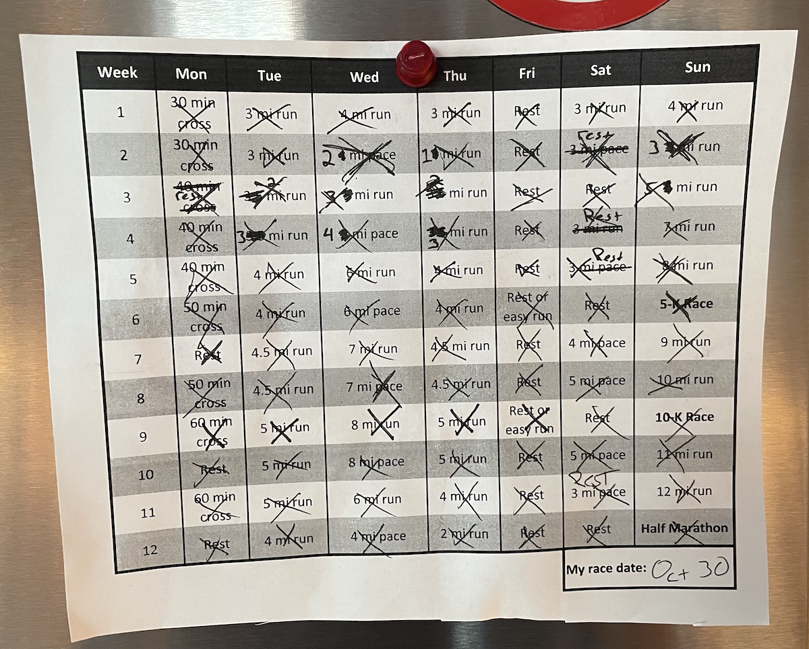
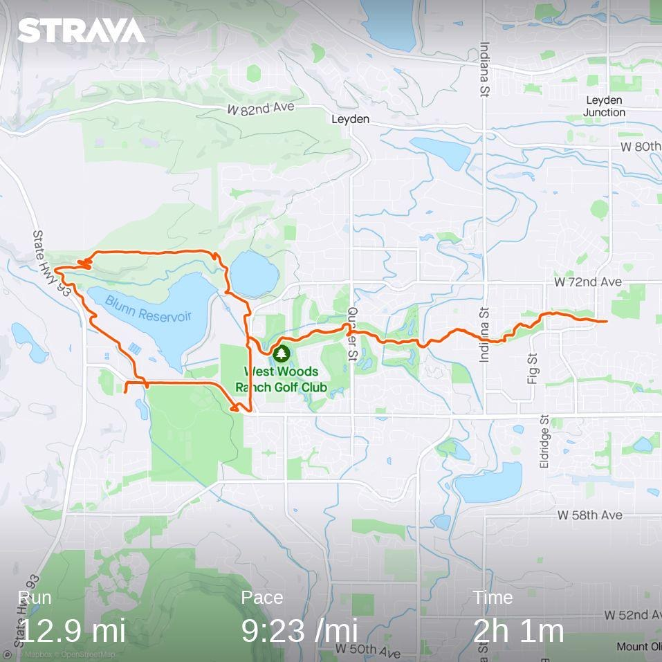
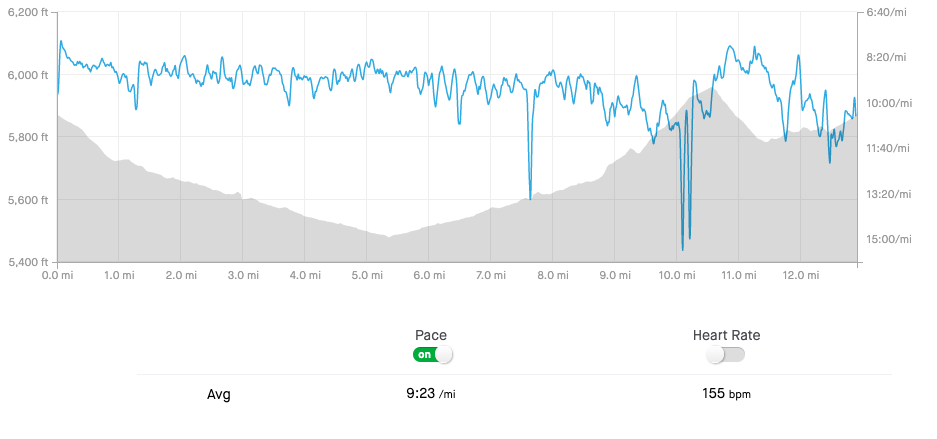
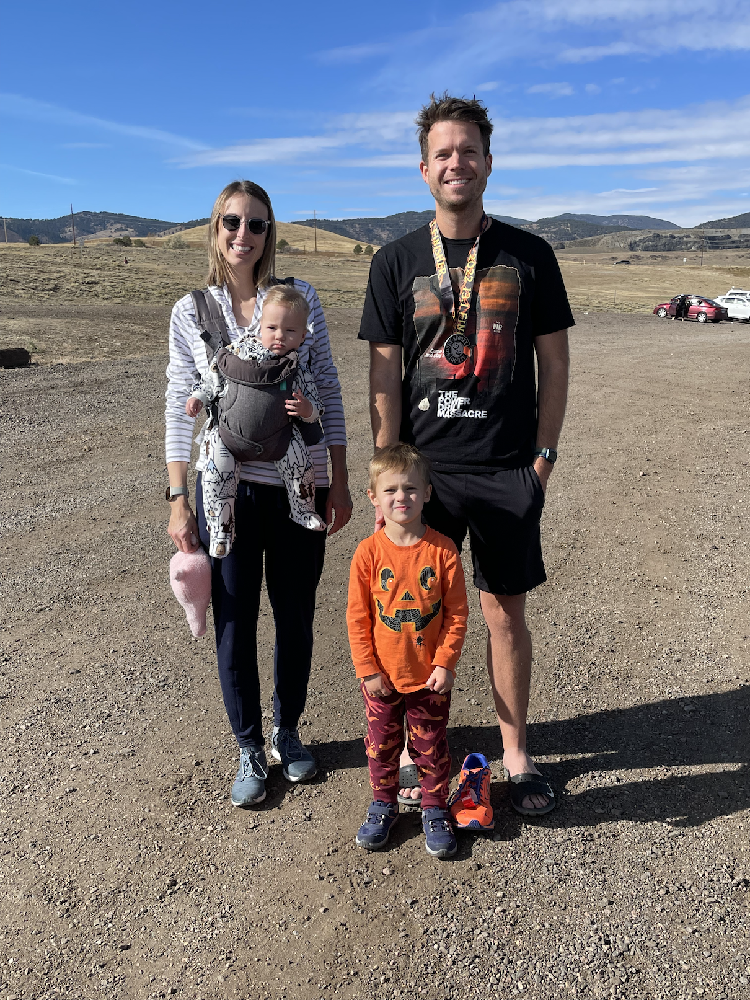

## A Brief History Lesson

I have been a regular runner the majority of my adult life. I never had a good relationship with exercise in high school or college. Playing team sports didn't interest me, and I was largely consumed by other extracurricular activities. After finishing my schooling, though, it became abundantly clear to me that my career and hobbies will keep me stationary for most of the day. So, in an effort to keep my heart healthy in my adult life (as well as maintain a body shape that I mostly enjoy), I started to exercise after college.

Distance running wasn't the first activity that I tried -- I swam laps at a local pool for a little more than a year until said pool was closed down for a couple of months for excessive maintenance. This is when I started to get into a better groove with running. I had never enjoyed running in gym classes -- anything more than a mile was like torture to me. But as an adult, I was able to approach it as more of a personal challenge than an obligation. I actually _wanted_ to get good at running because I couldn't think of a better way to work on my cardio fitness.

When I started to run with any sort of regularity in 2013, I learned very quickly that the way that my foot was striking the ground was causing some major pains in my knees. I reached out to a friend who was a prolific triathlete at the time, and he recommended that I switch to a mid/forefoot striking style, and shared with me this video, which detailed the technique (and has since been muted for using a Daft Punk song, apparently).



Changing the way that my foot was striking the ground ended up being the silver bullet for most of the pains that I had associated with running. Finally, with a pretty fresh and positive view of running, I was able to slowly start running longer distances. When we moved out to Colorado in 2017, I saw that as an opportunity to reinvent myself a little bit when it came to fitness. I completed a 10k in the spring of 2018, and a half marathon (titled "Kooky-Spooky") in the fall of the same year.

Since then, however, I haven't had the desire to train up for a half marathon. Having children and being trapped inside of my house due to the pandemic made me more of a lazier, squishier Zach Fleeman than I'd care to admit. I think my physical fitness hit rock bottom in February of this year -- I wasn't leaving my basement office for anything other than food, and I acquired some unhealthy habits that had me feeling heavier and weaker than I'd ever been. After having a few major bummer moments this summer with my health, I decided that I had enough, and that nothing was going to get me out of my fitness funk other than signing up for another race. So, I signed up for the same half marathon that I completed in 2018, picked my training plan, and started to train in the middle of August.

But wait, what's this? My scheduled vasectomy appeared out of nowhere at the end of July? How would this complicate things? Keep reading to find out!

## Training Program

[Hal Higdon](https://www.halhigdon.com/training-programs/half-marathon-training/intermediate-1-half-marathon/) has always been my go-to website for training schedules when preparing for my races. Other than the fact that I haven't looked at _any_ other race training schedules, I like that Hal's verbiage is straight-forward. The definitions for the activities on the schedule are detailed plainly on the same page, and the schedule itself looks nice when printed out and placed on your refrigerator door... Which is exactly what I did, because I had to make some slight adjustments.

While it may be entirely too personal to get this... _personal_ in an introductory blog post, the fact that I started training for this race only a couple of weeks after my vasectomy was massive confounding factor in the first few weeks. I started my training in the second week of this program. In addition to that delay, I also had to modify the miles as the days went on depending on how well my body was handling vasectomy recovery. As it turns out, I was able to run with little to no pain after a couple of weeks. I'm not even sure lessening the mileage was necessary for recovery purposes, but it really helped me get back into _some_ sort of shape after sitting in my basement with extremely limited movement after the surgery. 

The first few weeks of this program _hurt_. I felt so rigid and heavy when I was running, and I was lacking a lot of confidence that I had when I would train for races in previous years. I didn't even sign up for the race until I finished the my first eight mile Sunday run. It may have been my mind playing tricks on me, but after I signed up for the race, I started to get way more confident in my abilities. The vasectomy pains were gone, I was starting to adhere to the schedule without having to alter the miles or take extra rest time, and I even attained new personal speed records on certain distances, like the 5k and 10k race days.

Even though it is completely necessary, I really do not like tapering my running routine down in the weeks leading up to the race. The weeks following the 11 mile Sunday were a little boring for me, and it started to raise some doubts in my mind about if I'd be able to finish with a time that I'm happy with. My ultimate goal was to finish this race in under two hours, but if I could get it below my previous PR of one hour and fifty-eight minutes, that'd be even better. The absolute worst day of my training was the 12 mile Sunday. Not only did I have to stop several times to stretch out my right knee, I was slow, and it started to hail right as I crossed 10 miles.

It was a painful, soggy way to end what was a really uplifting exercise routine. But hey, it's about the journey, not the destination, right?

### Nutrition

As a quick aside, I'd like to talk about my nutrition during the program. I didn't change _much_, but I did start carbing up a little more before the longer runs starting at 9 miles. I'm not sure this helped anything, to be honest. Understanding how nutrition affects my runs doesn't strike my interest. I know that's short-sighted, and I _should_ care more about these types of things if I want to break personal records, but I lightly subscribe to the belief that your nutrition routine starts to hit a steady state when your body is put under this much stress. At the end of the day, I ate when I was hungry, I took a few snake oil supplements to help with joint pain, and I regularly had a protein shake after each run. I know nothing about supplements, and I think you're supposed to ingest protein after you exercise to help muscle growth. I'm probably wrong -- I should really speak to a doctor before I do _any_ of this stuff. All I know is that my calf muscles have never looked better.

## The Race

Race day was colder than I was used to during my training, but it didn't end up being that bad. The sun was out in full Colorado fashion, which helped my body temperature tremendously. I wore my usual running garb ([Bombas](https://bombas.com/) running socks, [Newton](https://www.newtonrunning.com/) shoes, [All in Motion](https://www.target.com/c/workout-shorts-activewear-men-s-clothing/all-in-motion/-/N-550z1Z4apdi) running shorts, and a Puppet Combo [t-shirt](https://puppetcombostore.com/products/the-power-drill-massacre-t-shirt)), and I only had to add a thin [Nike](https://www.nike.com/t/therma-fit-repel-element-mens-running-top-h8zsjP/DD5649-010) pullover shirt. Now, pretend that those were all affiliate links and send me some money.

As I mentioned earlier, I had run this race before in 2018, and the route didn't change at all. It starts off with several miles of an elevation decline, and the remainder of the race is climbing back up that elevation _and then some_. This didn't worry me as much in 2018, but it was freaking me out a little bit this year. I was confidently running more miles than I did in 2018, but my training routes this time around were much more flat. Was this going to be a problem?

It was! I ran very well during the first half of the race (despite some residual knee pain from the previous Sunday's 12 mile run), but the second I hit the elevation gains, I was toast. I mean I ___completely___ hit a brick wall of exhaustion the second I got towards the top of that hill. My pace was consistent with finishing well below my 1:58 goal, but it was in those moments at the top of the hill where I started having some doubts. Zooming back down the other side of the reservoir that we climbed was fun -- I got to experience some speed again, but unfortunately that didn't last during the slight incline over the last two miles to the finish line. I ended up finishing the race in two hours, one minute, and twelve seconds.

2:01:12 is still a respectable time for a half marathon, and ultimately, I'm proud of it. But yes, it stung _quite_ a bit that I couldn't stick it to the 29-year-version of myself. We had my wife's family in town, and the weather was so nice that I was happy to have time out of the house with people that I care about. There was also a Basset Hound in a costume at the finish line, which was awesome. I didn't ask him what his costume was, because he seemed busy. I wanted to get my picture taken with him, but it didn't happen. I snagged one with my wonderful family instead.

## What's Next?

I'm still debating how long I'm going to rest after this race. When my energy levels plummeted after that hill, my form and posture went to hell, and I seemingly injured my left hip and my right knee. I ran four miles after eight days of no running and had mixed results. My knee wasn't happy, but my hip loosened up as the run went on. I'll probably ice and stretch my knee for another week, and try a new, much-reduced running routine. I'd also like to start some more strength training with weights and stuff, but that has always been intimidating for me. I want to get into a mindless routine with strength training just like I have with running. Or would that be a bad thing because I'd have to buy a new keyboard every time I write a blog post? I'm assuming the stronger you get, the harder you type. If I get too big, I'll be breaking keys left and right.

