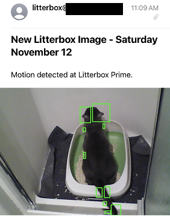

I recently got back home to Colorado after visiting friends and family in the Kansas City metro for Thanksgiving. This was the longest that I have been away from our house in years. We in KC for seven days, and I couldn't help but to be worried sick about my cat, Millie Bean, the entire time.

Obvious exaggerations aside, I was nervous about her being alone for that long without anybody in the house to monitor her litter box situation. Millie has had two notable potty accidents in our home, and they were all due to the fact that her litter box was not as clean as she would have liked. So, in addition to the cat sitter that we hired to empty her litter box every day, I decided that it was absolutely necessary to write my own email service to let me know whenever she went piddle.

And hell, I just wanted to write some hobby code for the first time in weeks.

## The Camera

I've had this [D-Link DCS-930L Wi-Fi](https://eu.dlink.com/uk/en/products/dcs-930l-wireless-n-network-camera) camera lying around unused for the better part of a decade. It is really easy to pluck an image off of it when you're connected on its shared network. Is it secure, or whatever? Who cares! As my network video camera solutions got a little bit more elaborate, I've left this `640x480` camera to collect dust in my electronics closet. Setting it up on your network is easy enough with the WPS functionality, and you can access a moment-in-time image by going to `http://<local ip address>/image.jpg` with some basic HTTP authorization. The the image URL returns a still of whatever the camera can see at that moment.

## The Code

I already have a GitHub repo for this project, so I'll just link that [here](https://github.com/zfleeman/litterbox-camera). Focus on the [`litterbox.py`](https://github.com/zfleeman/litterbox-camera/blob/main/litterbox.py) file.

Essentially, all I needed this script to do while I was on vacation was: 

1) Take a new still image from the camera on a set interval
2) Compare it to the previous frame
3) If there is a new element in the new image that is different-enough than the previous image, trigger a "change event."
4) Send me an email with the new image

Nearly all of the OpenCV code was ripped from another blog, but I had to make a few changes to get it to kick off the mailing process. If you look at line 23 in the snippet below, you can see that it calculates the difference in the two image arrays. With the resultant array, we can see how different the new image is by using the `.max()` method on our array. The bigger the number, the bigger the difference between the two images.

```python {linenos=true}
  while True:
    time.sleep(5)
    img = requests.get(img_url, auth=HTTPBasicAuth(cam_user, cam_pass)) # 

    # opencv2 samples ripped from
    # https://towardsdatascience.com/image-analysis-for-beginners-creating-a-motion-detector-with-opencv-4ca6faba4b42

    # 1. Load image; convert to RGB
    img_brg = np.array(Image.open(BytesIO(img.content)))
    img_rgb = cv2.cvtColor(src=img_brg, code=cv2.COLOR_BGR2RGB)

    # 2. Prepare image; grayscale and blur
    prepared_frame = cv2.cvtColor(img_rgb, cv2.COLOR_BGR2GRAY)
    prepared_frame = cv2.GaussianBlur(src=prepared_frame, ksize=(5,5), sigmaX=0)

    # 3. Set previous frame and continue if there is None
    if (previous_frame is None):
      # First frame; there is no previous one yet
      previous_frame = prepared_frame
      continue
    
    # calculate difference and update previous frame
    diff_frame = cv2.absdiff(src1=previous_frame, src2=prepared_frame)

    # 80 diff seemed to capture a "change event" - ZWF
    if diff_frame.max() > 80: 
      previous_frame = prepared_frame

```

When the threshold in line 26 is broken, we take the new image, draw some unnecessary rectangles around the biggest differences, and use my Amazon SES account to email me the new image.

## The Result

I didn't have much time to tweak the `time.sleep()` and max diff threshold, which led to my wife and I receiving hundreds of emails with pictures of our cat (and the cat sitter). If I had to change anything with this project, the new image timer would be longer, and the difference threshold would be set to 120 or so. I would also look for a better way to pull the large number of environment variables that I had to specify, but why spend 15 minutes improving the code in this silly little project when you could use that time to write a blog post about it?

