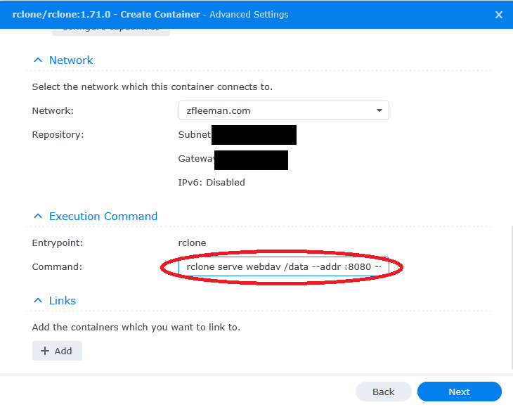
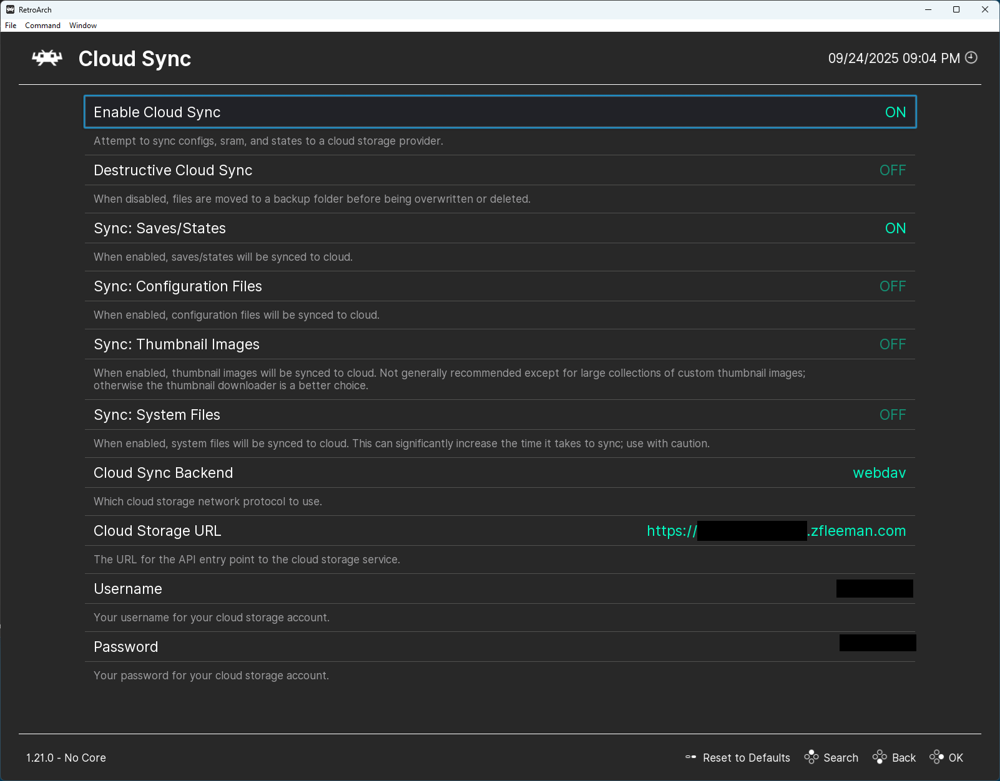

+++
date = '2025-09-24T22:36:12-06:00'
title = 'RetroArch Cloud Saves with an Rclone Docker Container'
summary = 'A nifty cross-cloud storage utility can serve as a WebDav host for your RetroArch configurations and save files!'
tags = ['retroarch','cloud sync','webdav','rclone','docker','emulation','save files','game saves','synology','nas','containerization','gaming','open source','cross platform','ios','windows','linux','configuration','tutorial','self-hosting','file sharing','subreddit','oracle cloud','object storage','flask','reverse proxy','technology','how-to','setup','guide','video games']
+++

RetroArch is a free, open-source frontend for emulators and other game engines. When you play games with RetroArch, you will generate save files for the game as well as emulation core configuration files. But what do you do if you want to use these saves on another computer, phone, or tablet? Sounds like you need a cloud sync solution!

### RetroArch and WebDav Cloud Saving
With the release of RetroArch 1.19.0 back in the spring of 2024, I began to mess with its new-ish "Cloud Sync" feature. I've always thought that syncing your configurations and save files across different RetroArch installs was a desperately needed feature, so needless to say, I dove right in when I had the chance. My primary RetroArch machine is my Windows PC, which is where I play most of my video games. But with RetroArch being available on iOS, Cloud Syncing of saves and configuration files became a priority of mine. Cloud saving retro video game save files? Is there anything cooler?

However, this new feature wasn't as intuitive as I would have liked initially.

The backend/protocol for cloud sync is WebDav, which is a more or less outdated HTTP protocol for managing files. I never really cared to learn that much about it, as I was able to find a Docker image, [bytemark/webdav](https://hub.docker.com/r/bytemark/webdav/), fairly quickly. I host all of my Docker containers on a Synology DS920+, which is my pride and joy. I love this thing. The speed at which I can get a website, Flask application, or some other free and open source software deployed and publicly available is astounding. I was able to get a WebDav server up and running, setting a username and password for security, but I found it to be not-so-stable, and it required a lot of extra work with my reverse proxy to handle the connection correctly.

### Enter Rclone

Unsatisfied with bytemark's WebDav container, I started searching around a little bit more for common WebDav Docker images. While I didn't find any other offerings that were more popular than bytemark's, I did find a comment on the RetroArch subreddit that piqued my interest. A user was asking what everyone was using to host a WebDav server. Most people linked to the bytemark image, but one user commented by saying only, "rclone."

Rclone? This is a tool that I've recently started using frequently at work -- it's a utility that helps standardize cloud storage get/put/list requests. I've found it incredibly helpful when copying data between regions in Oracle Cloud Infrastructure's Object Storage. Complex CLI commands become simple `rclone` statements.

But how can this be used to host a WebDav server?

Instead of dragging this on any longer, I'll just link to [Rclone's documentation for WebDav](https://rclone.org/commands/rclone_serve_webdav/). Turns out, a simple statement like:

```sh
rclone serve webdav
```

is enough to host a WebDav server on your localhost.

With this knowledge, I went straight to Rclone's Docker Hub page.

### Using Docker to Host a WebDav Server

The `docker run` command below is all you need to host a WebDav server on your machine. Notice on line 5 that the `rclone serve webdav` statement is exactly the same as it is above. The `/data` path that follows it is the directory inside the container that will host your saves and configs, which we volume-mounted on line 3. Specifying a user/pass is recommended, and actually, it _might_ be required for RetroArch initialize a connection.

```sh {linenos=true}
docker run \
  -p 8080:8080 \
  -v /data:/data \
  rclone/rclone:latest \
  rclone serve webdav /data \
  --addr :8080 \
  --user webuser \
  --pass secretpassword
```

Now, I could run that command after SSH-ing into my Synology, but because I've become a little spoiled with DSM's Container Manager, I just place the `rclone serve webdav` statement in the entrypoint field.



### RetroArch Cloud Sync Settings

After the container is running on your server, you just need to point your RetroArch install Cloud Sync settings to your server and enter your user/pass. Here is a screenshot of my settings.



I'm sure this setup is common knowledge, but I was very excited that I could use Rclone for a not-so-serious application, like passing my Zelda II save file between my phone, iPad, and Windows machine.